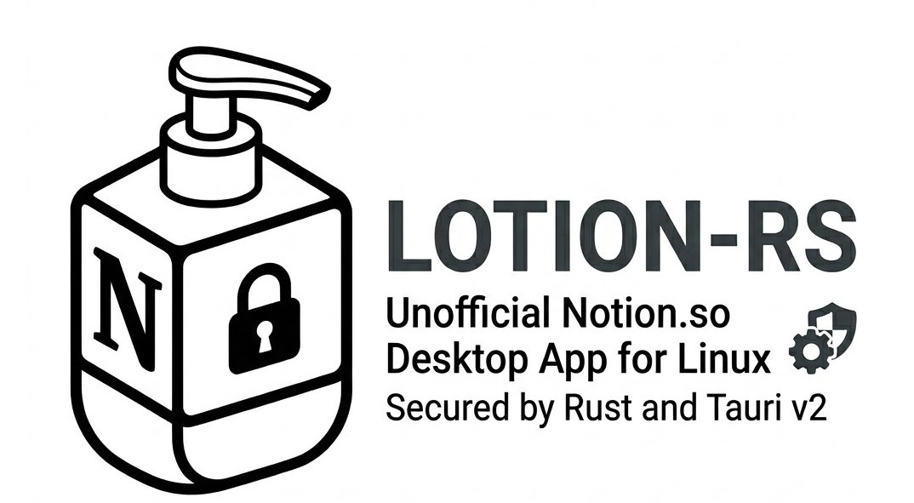

<p align="center">
  
</p>

<p align="center">
  <strong>A native Rust desktop client for Notion.so — built for Linux, engineered for adversarial environments.</strong>
</p>

### ☕ Donations

If this project saves you time or you just want to support its continued development, donations are welcome and very much appreciated.

**Ethereum (ETH / ERC-20):**
```
0xe7254b9a20a95658167a84120a84dce9326ef3ac
```

---

<p align="center">
  <a href="https://github.com/puneetsl/lotion">Based on Lotion by Puneet Singh Ludu</a> &nbsp;·&nbsp;
  <a href="https://github.com/SecByDesignCollective/Manifesto">Security Philosophy: SecByDesign Manifesto</a>
</p>

---

# Lotion-rs

**Notion does not have a native Linux desktop client.** That gap is why the original [Lotion](https://github.com/puneetsl/lotion) Electron application was created by [Puneet Singh Ludu](https://github.com/puneetsl) — to give Linux users a proper, integrated Notion experience without resorting to the browser.

**Lotion-rs** is a complete port of that concept into Rust. It replaces the Electron/Node.js stack with [Tauri v2](https://v2.tauri.app/) for OS integration and a native injected UI, eliminating the heavy runtime overhead of a Chromium-based shell while adding a hardened, Zero-Trust security model aligned with the [SecByDesign Collective Manifesto](https://github.com/SecByDesignCollective/Manifesto).

The result is a fast, memory-efficient, privacy-respecting Notion client that runs natively on Linux — and nowhere compromises on security.

---

## Why This Exists

Notion HQ has historically deprioritised Linux. The web app works, but it offers no system integration: no tray icon, no native window controls, no OS-level theming, no spell check, no session persistence.

The original Lotion solved this brilliantly using Electron. But Electron carries a cost:
- A bundled Chromium (~100 MB+)
- A Node.js runtime
- A large memory footprint
- No memory-safe systems layer

Lotion-rs keeps everything that made Lotion great and rebuilds the foundation in Rust:

| | Original Lotion | Lotion-rs |
|---|---|---|
| **Language** | TypeScript / JavaScript | Rust |
| **Runtime** | Electron + Node.js | Tauri v2 (native) |
| **UI** | Chromium renderer | System WebView + Injected native UI chrome |
| **Memory** | ~200–400 MB | ~60–100 MB |
| **Security** | Standard Electron sandbox | Zero-Trust + LiteBox sandboxing |
| **Config** | JSON | TOML (`~/.config/lotion-rs/config.toml`) |
| **Packages** | `.deb`, `.rpm`, `.zip` | `.deb`, `.rpm`, `.AppImage` |

---

## Security Philosophy

This project is developed in the spirit of the [Zero-Trust Engineering Manifesto](https://github.com/SecByDesignCollective/Manifesto):

> *"We do not design for ideal conditions. We engineer for the worst case, because in modern adversarial environments, the worst case is the baseline."*

What that means in practice for Lotion-rs:

- **Zero-Trust by Default** — No network segment is trusted. The application enforces strict Content Security Policies and allows only verified Notion domains.
- **LiteBox Sandboxing** — The Notion WebView runs in an isolated sandbox. Navigation to arbitrary URLs is blocked at the policy layer before a request is even made.
- **Least Privilege** — The application requests only the OS permissions it requires. No access to your filesystem beyond `~/.config/lotion-rs/`.
- **Anti-Telemetry** — No usage data, analytics, or crash reports are sent anywhere. What happens on your machine stays on your machine.
- **Fail-Safe Defaults** — If configuration is missing or malformed, the application falls back to safe, hardened defaults rather than failing open.
- **Radical Transparency** — The source code is fully open for audit. Every security claim can be verified by reading the code.

---

## Features

### Core
- **Full Notion.so Access** — Complete feature parity with the Notion web app, running natively on Linux.
- **Multi-Tab Interface** — Open multiple Notion pages simultaneously, with tab persistence across restarts (`restore_tabs = true` in config).
- **Native Window Controls** — Custom frameless window with a Mac-style injected title bar, tab bar, and navigation controls.
- **System Tray Integration** — Minimise to tray and restore from tray without losing your session.

### Security
- **LiteBox WebView Sandbox** — The Notion WebView is isolated; only `notion.so` and its authorised subdomains may load content.
- **Strict Navigation Policy** — Requests to external domains are intercepted and either blocked or delegated to the system browser.
- **No Remote Telemetry** — Zero data exfiltration. No analytics, no crash reporting pipeline, no "phone home".

### Customisation
- **Theme Engine** — Ships with built-in themes (Dracula, Nord, and more). Theme is persisted to `~/.config/lotion-rs/config.toml`.
- **Custom CSS Injection** — Point `custom_css_path` in your config at any `.css` file to inject custom styles into the Notion interface at runtime.
- **TOML Configuration** — Human-readable config file at `~/.config/lotion-rs/config.toml` with hot-reloadable settings.

### Platform
- **Linux-First** — Primary development and testing target. Packages: `.deb`, `.rpm`, `.AppImage`.
- **macOS Support** — Universal binary for x64 and ARM64 (Apple Silicon).
- **Spell Check** — Leverages the system WebView's built-in spell checking.
- **Auto-Update** — Built-in update mechanism via Tauri's updater plugin.

---

## Installation

### 📦 Download Pre-built Packages

You can download the latest version for your platform here:

- [🐧 Linux (.deb)](https://github.com/diegoakanotoperator/lotion-rs/releases/latest/download/lotion-rs_amd64.deb)
- [🐧 Linux (.AppImage)](https://github.com/diegoakanotoperator/lotion-rs/releases/latest/download/lotion-rs.AppImage)
- [🐧 Linux (.rpm)](https://github.com/diegoakanotoperator/lotion-rs/releases/latest/download/lotion-rs.rpm)
- [🍎 macOS Intel (x64 .dmg)](https://github.com/diegoakanotoperator/lotion-rs/releases/latest/download/lotion-rs-x64.dmg)
- [🍎 macOS Silicon (arm64 .dmg)](https://github.com/diegoakanotoperator/lotion-rs/releases/latest/download/lotion-rs-arm64.dmg)
- [🪟 Windows (x64 .exe)](https://github.com/diegoakanotoperator/lotion-rs/releases/latest/download/lotion-rs-setup.exe)

### Debian / Ubuntu

```bash
sudo dpkg -i lotion_*.deb
```

### Fedora / RHEL

```bash
sudo rpm -i lotion-*.rpm
```

### AppImage (any Linux)

```bash
chmod +x Lotion_*.AppImage
./Lotion_*.AppImage
```

### Windows

Download and run the `lotion-rs-setup.exe` installer.

---

## Building from Source

### Prerequisites

**Linux:**
```bash
sudo apt-get install -y \
  libwebkit2gtk-4.1-dev \
  build-essential curl wget file \
  libxdo-dev libssl-dev \
  libayatana-appindicator3-dev \
  librsvg2-dev
```

**macOS:**  
Xcode Command Line Tools are sufficient. No extra dependencies required.

**Windows:**
- **[Visual Studio Build Tools](https://visualstudio.microsoft.com/visual-cpp-build-tools/)** (Required for C++ compilation)
- **[vcpkg](https://vcpkg.io/)** (Required to provide the `hunspell` dependency)

**All platforms:**
```bash
# Install Rust (if not already installed)
curl --proto '=https' --tlsv1.2 -sSf https://sh.rustup.rs | sh

# Install Tauri CLI
cargo install tauri-cli --version "^2.0"
```

### Build

```bash
git clone https://github.com/diegoakanotoperator/lotion-rs.git
cd lotion-rs/src-tauri
cargo tauri build
```

Packaged bundles will be output to `src-tauri/target/release/bundle/`.

### Development Run

```bash
cd src-tauri
cargo tauri dev
```

---

## Configuration

Lotion-rs stores its configuration at `~/.config/lotion-rs/config.toml`. The file is created automatically on first run with sensible defaults.

```toml
# Active UI theme
active_theme = "dracula"

# Optional: path to a custom CSS file to inject into the Notion interface
# custom_css_path = "/home/user/.config/lotion-rs/my-theme.css"

# Whether to restore open tabs on next launch
restore_tabs = true

[window]
width = 1200.0
height = 800.0
maximized = false
```

| Key | Default | Description |
|---|---|---|
| `active_theme` | `"dracula"` | Name of the built-in theme to apply |
| `custom_css_path` | `null` | Absolute path to a custom CSS file |
| `restore_tabs` | `true` | Restore open tabs on launch |
| `window.width` | `1200` | Initial window width in pixels |
| `window.height` | `800` | Initial window height in pixels |
| `window.maximized` | `false` | Start maximised |

---

## Project Structure

```
lotion-rs/
├── src-tauri/           # Rust / Tauri backend
│   ├── src/
│   │   ├── main.rs           # Entry point, Tauri app bootstrap
│   │   ├── config.rs         # TOML config load/save
│   │   ├── window_controller.rs  # Window state management
│   │   ├── tab_controller.rs     # Multi-tab logic
│   │   ├── tab_manager.rs    # Tab orchestration
│   │   ├── policy.rs         # Zero-Trust policy enforcement
│   │   └── theming.rs        # Native CSS/JS theming engine
│   ├── assets/          # Icons, banner, CSS themes
│   ├── i18n/            # Internationalisation strings
│   └── tauri.conf.json  # Tauri v2 configuration
└── .github/workflows/   # CI/CD: build and release pipeline
```

---

## CI / CD

The project uses GitHub Actions to build and release on every tagged version (`v*`). Builds are produced for:

- Linux x86_64 → `.deb`, `.rpm`, `.AppImage`
- macOS x86_64 → `.dmg`
- macOS aarch64 (Apple Silicon) → `.dmg`
- Windows x86_64 → `.exe` (NSIS)

See [`.github/workflows/release.yml`](.github/workflows/release.yml) for the full pipeline definition.

---

## Acknowledgments

- **[Puneet Singh Ludu](https://github.com/puneetsl)** — Creator of the original [Lotion](https://github.com/puneetsl/lotion) Electron application for Linux. Lotion-rs would not exist without that project's vision of bringing Notion natively to the Linux desktop. Tremendous respect and thanks.
- **[sysdrum/notion-app](https://github.com/sysdrum/notion-app)** — Early inspiration referenced in the original Lotion project.
- **[SecByDesign Collective](https://github.com/SecByDesignCollective/Manifesto)** — The Zero-Trust Engineering Manifesto, which defines the security philosophy this project is built on.
- **[Tauri v2](https://v2.tauri.app/)** — The framework that makes a lightweight, cross-platform, Rust-native desktop app possible.
- **[Microsoft LiteBox](https://github.com/microsoft/LiteBox)** — The sandboxing technology used to isolate the Notion WebView, providing the Zero-Trust process containment layer at the core of Lotion-rs's security model.

---

## Support the Project

### 💼 Open to Work

I'm currently **looking for a job** — open to roles in systems programming, security engineering, Rust development, or Linux desktop tooling. If you're hiring or know of an opportunity, feel free to reach out via a GitHub issue or discussion.

### ☕ Donations

If this project saves you time or you just want to support its continued development, donations are welcome and very much appreciated.

**Ethereum (ETH / ERC-20):**
```
0xe7254b9a20a95658167a84120a84dce9326ef3ac
```

---

## Disclaimer

This is an unofficial, community-maintained application. It is not affiliated with, endorsed by, or supported by Notion Labs, Inc. Please respect [Notion's Terms of Service](https://www.notion.so/Terms-and-Privacy-28ffdd083dc3473e9c2da6ec011b58ac) when using this software.

---

## License

MIT License — see [LICENSE](LICENSE) for full text.
